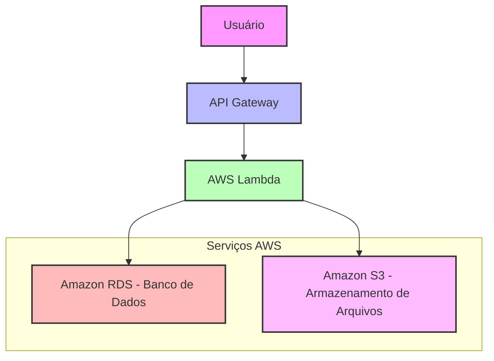

# Infraestrutura da AWS - Plataforma Virtual de Farmácia

## Descrição do Projeto

Este repositório contém o relatório de implementação de serviços AWS para uma plataforma virtual fictícia de uma farmácia, com foco em redução de custos imediatos. O projeto foi desenvolvido como parte do desafio prático da DIO (Digital Innovation One), replicando e melhorando conceitos de infraestrutura em nuvem.

## Objetivo

Elencar e implementar 3 serviços AWS que contribuam para a diminuição de custos operacionais em uma empresa fictícia chamada SynapseDev, especializada em soluções de farmácia online.

## Serviços AWS Implementados

### Etapa 1: Amazon S3
- **Foco**: Armazenamento de dados estáticos e arquivos.
- **Caso de Uso**: Utilizado para armazenar imagens de medicamentos, documentos e backups de forma escalável e com custos baixos. Permite acesso global e reduz a necessidade de infraestrutura própria de armazenamento, otimizando custos de storage.

### Etapa 2: AWS Lambda
- **Foco**: Computação serverless.
- **Caso de Uso**: Implementação de funções serverless para processar pedidos e notificações. Paga-se apenas pelo tempo de execução, diminuindo custos operacionais comparado a servidores dedicados, ideal para workloads variáveis.

## Arquitetura da Plataforma

Abaixo, um diagrama simplificado da arquitetura proposta para a plataforma virtual de farmácia, utilizando os serviços AWS selecionados:

### Descrição do Diagrama
- **Usuário**: Representa o cliente acessando a plataforma.
- **API Gateway**: Ponto de entrada para as APIs, roteando requisições.
- **AWS Lambda**: Processa lógica de negócio de forma serverless.
- **Amazon RDS**: Armazena dados relacionais da farmácia.
- **Amazon S3**: Armazena arquivos estáticos como imagens de medicamentos.

Este diagrama ilustra como os serviços se integram para reduzir custos, com foco em escalabilidade e eficiência.

## Benefícios Esperados

- Redução significativa de custos operacionais.
- Aumento da escalabilidade e eficiência da plataforma.
- Melhoria na produtividade e confiabilidade dos serviços.

## Arquivos do Projeto

- `modelo-relatorio.md`: Relatório completo da implementação, incluindo introdução, descrição das etapas, conclusão e anexos.

## Links Úteis

- [Documentação AWS S3](https://aws.amazon.com/s3/)
- [Documentação AWS Lambda](https://aws.amazon.com/lambda/)
- [Documentação Amazon RDS](https://aws.amazon.com/rds/)
- [Repositório Original (para referência)](https://github.com/Patrick-Lima-DEV/-Infraestrutura-da-AWS)

## Como Usar

1. Clone este repositório: `git clone https://github.com/Patrick-Lima-DEV/-Infraestrutura-da-AWS.git`
2. Leia o relatório em `modelo-relatorio.md` para detalhes da implementação.

## Contribuições

Este projeto é uma réplica e melhoria do desafio proposto. Para evoluções, considere fazer um fork e adicionar suas próprias modificações.

## Licença

Este projeto é para fins educacionais e não possui licença específica.

---

**Data do Projeto**: 14 de janeiro de 2026  
**Empresa**: SynapseDev 
**Responsável**: [Patrick Dos Santos Lima]